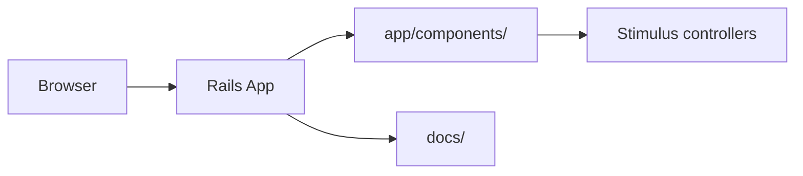

# Technical Specification — Accessibility Rails Components

## Overview

Rails ViewComponent library that implements WCAG 2.1 AA accessible UI patterns as reusable, testable components.

## Problem statement

Product teams need reusable UI building blocks that remain accessible, testable, and maintainable across releases without treating accessibility as a post-ship patch.

## Solution summary

A Rails application structured around ViewComponent-style components with accessibility requirements embedded in component APIs, documentation, and test workflows.

## Architecture

### Components

| Component | Responsibility |
|-----------|----------------|
| `app/components/` | Accessible UI primitives (buttons, modals, forms) |
| `app/controllers/` | Demo and integration endpoints |
| `config/` | Rails configuration and routes |
| `docs/` | Usage guidance and accessibility notes |

## Tech stack

| Layer | Technology |
|-------|------------|
| Application | Ruby on Rails |
| Components | ViewComponent-style architecture |
| Frontend | Stimulus, Tailwind-oriented patterns |
| Testing | Rails test stack, accessibility checks |

## Interfaces

### APIs / entry points

- HTTP: Rails server on default port (`rails server`)
- Components: rendered via Rails views and component classes

### Configuration

- `Gemfile`, `config/application.rb`, `config/routes.rb`

## Data and persistence

- Standard Rails database setup via `rails db:setup` when persistence is enabled for demos.

## Deployment

- **Target:** Render (live demo referenced in repository metadata)
- **Build:** `bundle install`
- **Run:** `rails server`
- **Health:** Rails root route / component demo pages

## Testing strategy

| Layer | Command | Coverage |
|-------|---------|----------|
| Unit / component | `rails test` | Component behavior and regressions |
| Accessibility | documented in `docs/` | WCAG-oriented checks |

## Security and reliability notes

- Components should preserve focus management, labels, and keyboard operability by default.
- Avoid introducing client-only state without server-rendered accessible fallbacks.

## Evidence map (reviewer paths)

| Concern | Path |
|---------|------|
| Component definitions | `app/components/` |
| Application integration | `app/`, `config/` |
| Documentation | `docs/` |
| Dependencies | `Gemfile` |

## Architecture decisions

Record significant decisions in `docs/adr/`. Start with `docs/adr/0001-record-architecture-decisions.md`.

---

**Maintained by:** [Dark Heart Labs](https://darkheartlabs.technology)  
**Author:** Jennifer ([@jv-darkheartlabs](https://github.com/jv-darkheartlabs))  
**Site:** https://darkheartlabs.technology
